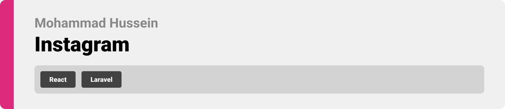
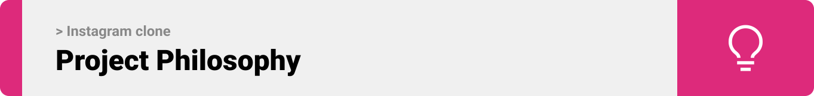
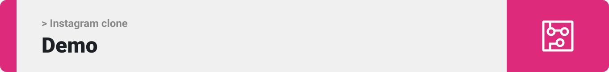
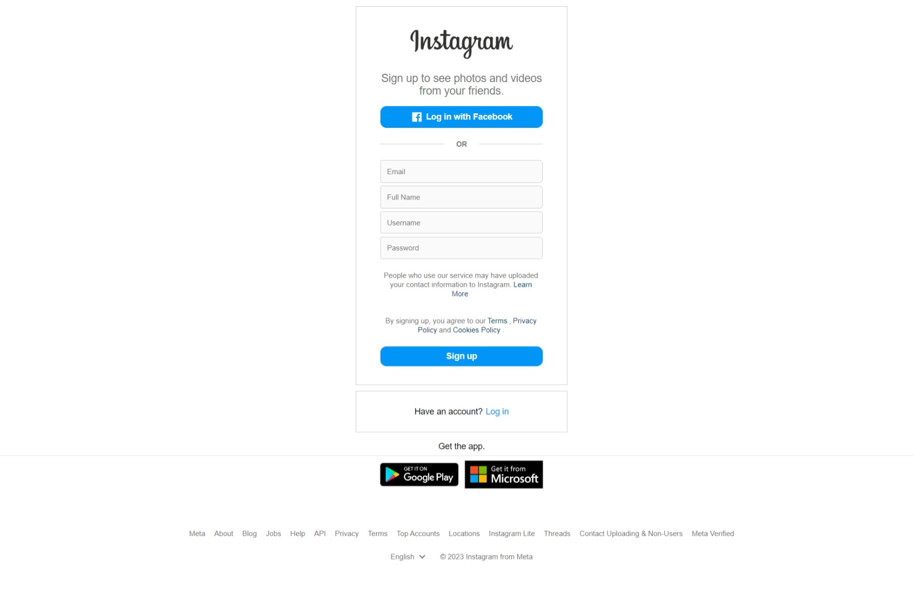
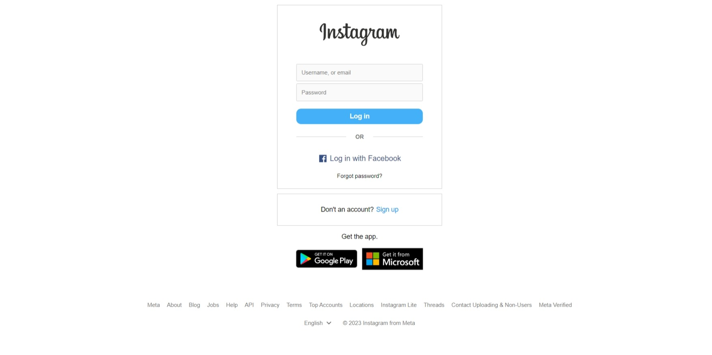
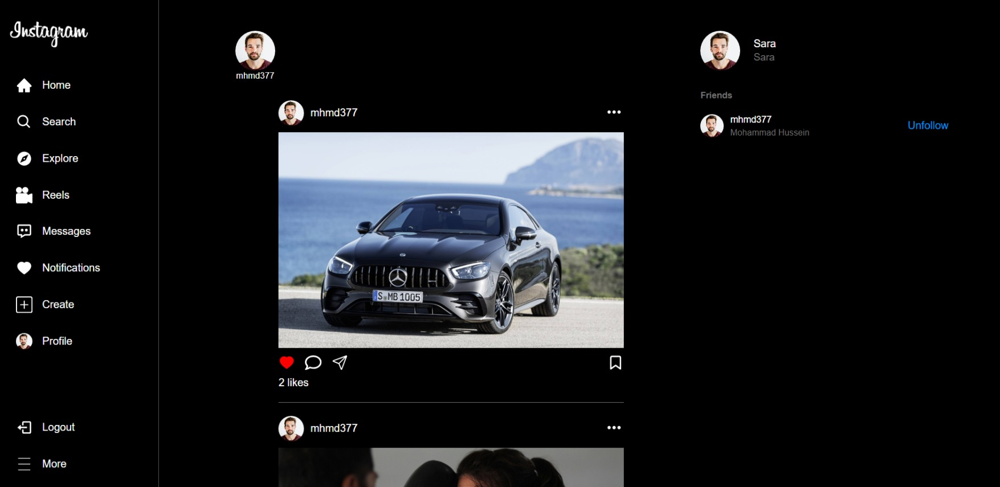
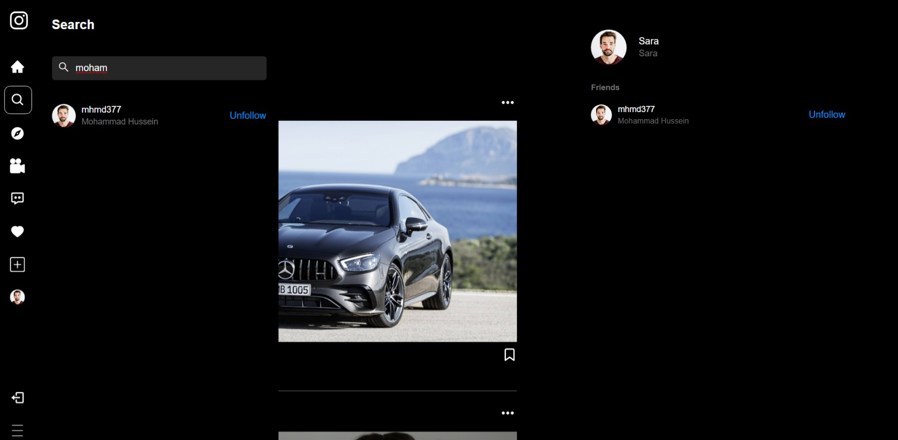
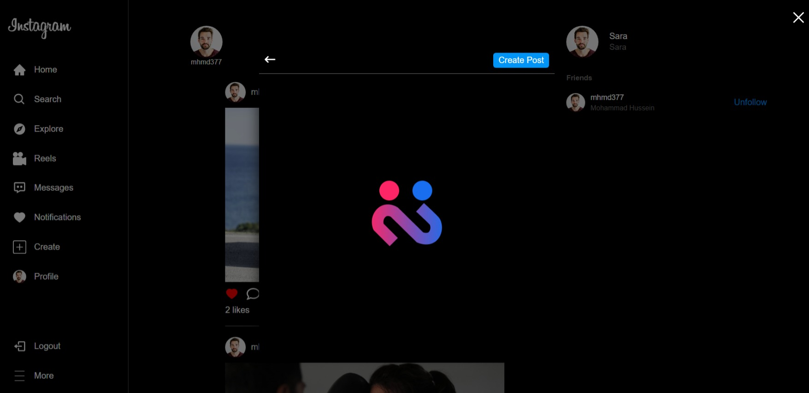
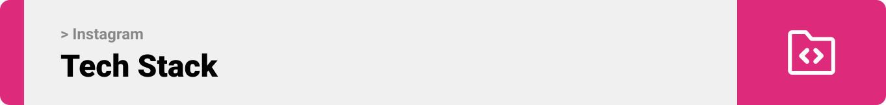

- [Project Philosophy](#project-description)
  - [User stories](#user-stories)
- [Demo](#demo)
- [Tech Stack](#tech-stack)
- [How to Run](#how-to-run)
  - [Prerequisites](#prerequisites)
  - [Installation](#installation)

<br><br>

<!-- project philosophy -->
<a name="project-description"></a>


> 
>
> 

<a name="user-stories"></a>
### User Stories


<br><br>

<!-- Demo -->
<a name="demo"></a>


| Signup | Login | Browse Following Posts |
| ---| ---| ---|
|  |  |  |
###
| Search Users  | Create Post | |
| ---| ---| ---|
|  |  | |

<br><br>

<!-- Tech stack -->
<a name="tech-stack"></a>


###  Instagram clone is built using the following technologies:


<br><br>

<!-- How to run -->
<a name="how-to-run"></a>


> To set up Instagram clone locally, follow these steps:

### Prerequisites
<a name="prerequisites"></a>

* npm
  ```sh
  npm install npm@latest -g
  ```

### Installation
<a name="installation"></a>

1. Ensure you have Node.js installed. We recommend using the latest version available.
2. Clone the repo
   ```sh
   git clone https://github.com/mhmdhussein377/Instagram-Clone-Laravel-React.git
   ```
3. Navigate to

   ```sh
   cd Online-Recipe-website-React-Laravel/Backend
   ```
4. Run composer install
   
   ```sh
   composer install
   ```
5. Initialize the database
   
   ```sh
   php artisan migrate
   ```
6. Serve to start the server
    
   ```sh
   php artisan serve
   ```
7. Install NPM packages
   ```sh
   cd client
   ```
   ```sh
   npm install
   ```
8. Run the project
   ```sh
   cd client
   ```
   ```sh
   npm run dev
   ```

Now, you should be able to run Instagram clone locally and explore its features.
