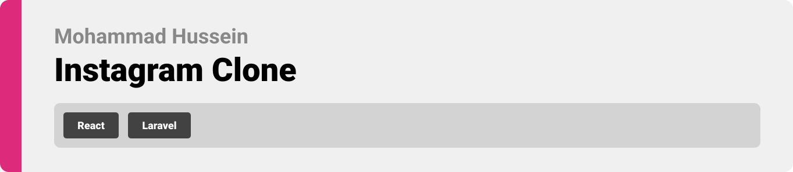

- [Project Philosophy](#project-description)
  - [User stories](#user-stories)
- [Demo](#demo)
- [Tech Stack](#tech-stack)
- [How to Run](#how-to-run)
  - [Prerequisites](#prerequisites)
  - [Installation](#installation)

<br><br>

<!-- project philosophy -->
<a name="project-description"></a>


> InstaClone is a social platform where users can share photos, connect with friends, and explore visual content. Whether you're sharing your moments, connecting with others, or discovering inspiring photos, InstaClone has it all. It's a simple and enjoyable way to share and view images.

<a name="user-stories"></a>
### User Stories
- As a user, I want to create an account and log in so that I can access the platform and interact with others.
- As a user, I want to share photos so that I can share my moments and experiences.
- As a user, I want to like photos so that I can express my appreciation for the content.
- As a user, I want to follow and unfollow other users so that I can stay updated with their posts or manage my feed.
- As a user, I want to see a feed of photos from users I follow so that I can view their latest updates.
- As a user, I want to discover new users and their photos so that I can expand my network and explore diverse content.

<br><br>

<!-- Demo -->
<a name="demo"></a>


| Signup | Login | Browse Following Posts |
| ---| ---| ---|
|  |  |  |
###
| Search Users  | Create Post | |
| ---| ---| ---|
|  |  | |

<br><br>

<!-- Tech stack -->
<a name="tech-stack"></a>


###  Instagram clone is built using the following technologies:
React: The frontend is developed using React to create an engaging and user-friendly interface for sharing and viewing photos.
Node.js with Express: The backend is powered by Node.js with the Express.js framework, handling user authentication, photo uploads, and interactions.
MongoDB: MongoDB is used as the database system to store user profiles, photos, likes, and other relevant data for the platform.

<br><br>

<!-- How to run -->
<a name="how-to-run"></a>


> To set up Instagram clone locally, follow these steps:

### Prerequisites
<a name="prerequisites"></a>

* npm
  ```sh
  npm install npm@latest -g
  ```

### Installation
<a name="installation"></a>

1. Ensure you have Node.js installed. We recommend using the latest version available.
2. Clone the repo
   ```sh
   git clone https://github.com/mhmdhussein377/Instagram-Clone-Laravel-React.git
   ```
3. Navigate to

   ```sh
   cd Online-Recipe-website-React-Laravel/Backend
   ```
4. Run composer install
   
   ```sh
   composer install
   ```
5. Initialize the database
   
   ```sh
   php artisan migrate
   ```
6. Serve to start the server
    
   ```sh
   php artisan serve
   ```
7. Install NPM packages
   ```sh
   cd client
   ```
   ```sh
   npm install
   ```
8. Run the project
   ```sh
   cd client
   ```
   ```sh
   npm run dev
   ```

Now, you should be able to run Instagram clone locally and explore its features.
